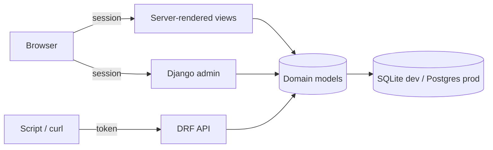
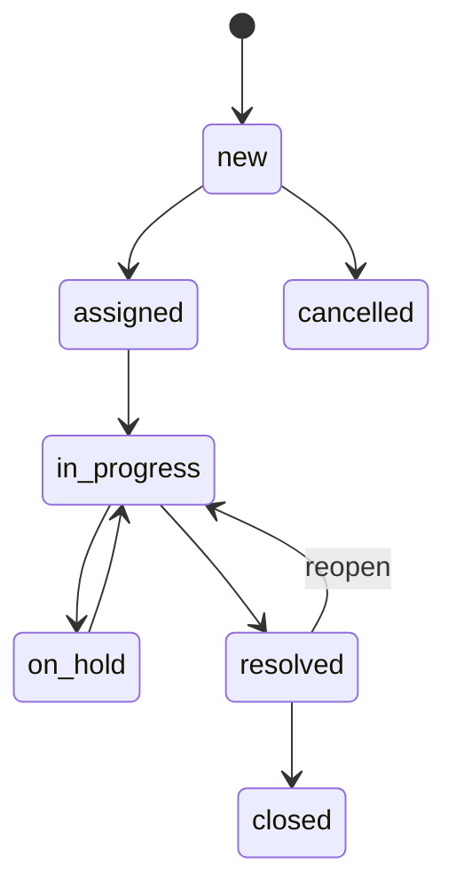

# Service Desk

An internal IT service desk (ITSM) built full-stack in **Django 6 + Django REST
Framework**. Tickets move through a status workflow with SLA due dates and
breach detection; every change is recorded on an audit timeline. It ships three
surfaces over the same models: the **Django admin**, **server-rendered** pages,
and a **DRF API** with an OpenAPI schema and Swagger UI.

[](https://github.com/saad-mughal435/servicedesk/actions/workflows/ci.yml)
[](LICENSE)
[](https://www.python.org/)
[](https://www.djangoproject.com/)

**Live demo:** https://servicedesk.onrender.com — log in with `agent` /
`demo12345` (also `manager` and `requester`, same password). Hosted on a free
instance, so the first request after it has been idle can take ~30–60s to wake.

## Why this exists

I spent two years in telecom NOC / support operations (PTCL) before moving into
ERP/MES software, so a ticketing system is close to home. My other backend
sample, [`shopfloor-api`](https://github.com/saad-mughal435/shopfloor-api), is a
headless Spring Boot service; this one is deliberately the opposite shape — a
full-stack Django app that leans on the framework's batteries (admin, ORM and
migrations, auth groups, templates) alongside a REST API. It is also the *real*
persistent, authenticated, deployed counterpart to the client-side support demo
on my site, not a mock.

## Architecture

```
apps/
  accounts/   Team, AgentProfile; role groups (agents / managers / requesters)
  assets/     Asset — a light CMDB a ticket can reference
  sla/        SlaPolicy + a pure due-date service (the unit-test centerpiece)
  tickets/    Category, Ticket, Comment, TicketEvent + API + views + admin + seed
config/       settings (env-driven), urls, wsgi/asgi
templates/    base, login, dashboard, ticket list / detail / form
```

Request flow:



Ticket lifecycle:



Key design choices:

- **Built-in `User` + Groups** for identity and roles — no custom user model.
  `requesters` raise and track their own tickets; `agents` work all tickets;
  `managers` add reassignment, deletes and config edits. Superusers pass every
  check.
- **SLA** targets live in `SlaPolicy` (per priority, with a default). The due
  time is a pure function in `apps/sla/services.py`, applied on ticket creation;
  `Ticket.evaluate_sla()` derives the breach flag from the due time and
  resolution state.
- **Audit timeline** via `TicketEvent`. Creation, assignment, status changes,
  resolution and comments are recorded by the model's transition methods and a
  signal, so the timeline stays automatic rather than caller-dependent.
- **Auth on the API** is session (for the browsable API / Swagger) plus token
  (`POST /api/auth/token/` for scripts) — a deliberate contrast with the JWT in
  `shopfloor-api`.

## Roles

| Group | Server pages | API | Admin |
|-------|--------------|-----|-------|
| `requesters` | Their own tickets; create + comment | Read/create own only | — |
| `agents` | All tickets; assign, resolve, comment | Read all; write; lifecycle actions | Staff (no delete) |
| `managers` | Everything agents can do | Adds delete + config writes | Staff (full) |

## API

| Method | Path | Notes |
|--------|------|-------|
| POST | `/api/auth/token/` | Obtain an auth token |
| GET, POST | `/api/tickets/` | List (filter/search/order) / create |
| GET, PATCH, DELETE | `/api/tickets/{id}/` | Retrieve / update / delete (manager) |
| POST | `/api/tickets/{id}/assign/` | Body `{"assignee": <user_id>}` |
| POST | `/api/tickets/{id}/resolve/` · `/reopen/` | Lifecycle actions |
| GET, POST | `/api/tickets/{id}/comments/` | Worklog (requesters don't see internal notes) |
| GET | `/api/categories/` `/api/teams/` `/api/assets/` `/api/sla-policies/` | Reference data |
| GET | `/api/schema/` · `/api/schema/swagger-ui/` · `/api/schema/redoc/` | OpenAPI |

Filtering on tickets: `status`, `priority`, `ticket_type`, `assignee`, `team`,
`category`, `sla_breached`; search on `key`, `title`, `description`; ordering on
`created_at`, `sla_due_at`, `priority`, `updated_at`.

## Run it locally

Requires Python 3.12+ (developed on 3.14). On Windows the launcher is `py`.

```bash
python -m venv .venv
.venv\Scripts\activate          # Windows; use source .venv/bin/activate elsewhere
pip install -r requirements-dev.txt

copy .env.example .env          # then set DEBUG=true; cp on macOS/Linux
python manage.py migrate
python manage.py seed           # demo users, SLA policies, ~60 tickets
python manage.py runserver
```

Open http://127.0.0.1:8000 and sign in as `agent` / `demo12345`. The admin is at
`/admin/` (create a superuser with `python manage.py createsuperuser`), and the
API docs at `/api/schema/swagger-ui/`.

Checks (what CI runs):

```bash
ruff check .
python manage.py makemigrations --check --dry-run
python manage.py check
pytest
```

## Configuration

Settings read the environment via `django-environ` (see `.env.example`):
`SECRET_KEY`, `DEBUG`, `DEMO_MODE`, `ALLOWED_HOSTS`, `CSRF_TRUSTED_ORIGINS`,
`DATABASE_URL`. Local/CI default to SQLite; production uses `DATABASE_URL`.

- **`DEMO_MODE`** disables deletes for non-superusers (so a public demo can't be
  trashed) and pre-fills the demo credentials on the login page.
- With `DEBUG=false`, HTTPS redirect, secure cookies, HSTS and the
  forwarded-proto header are enabled for deployment behind a TLS proxy.

## Deployment

Deployed on **Render** (web service) with a **Neon** Postgres database; see
`render.yaml` and `build.sh`. The build installs dependencies, runs
`collectstatic` (WhiteNoise serves the hashed assets) and `migrate`, then seeds
demo data on first boot. CI verifies; Render auto-deploys on push to `main`.

Notes: Render's free instance sleeps after ~15 minutes idle (hence the cold
start); use Neon's pooled connection string with `sslmode=require`; the free
disk is ephemeral, so SQLite is never used in production. To periodically reset
the demo, run `python manage.py seed --flush` (e.g. a scheduled job).

## License

[MIT](LICENSE)
